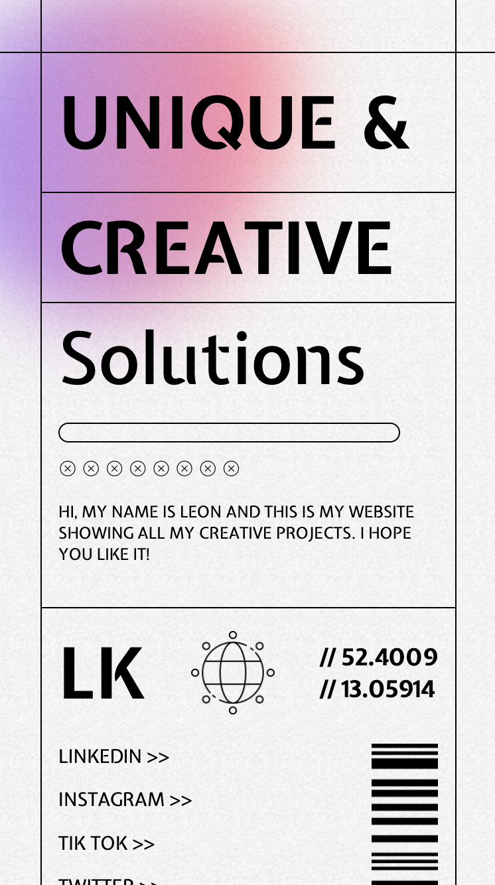
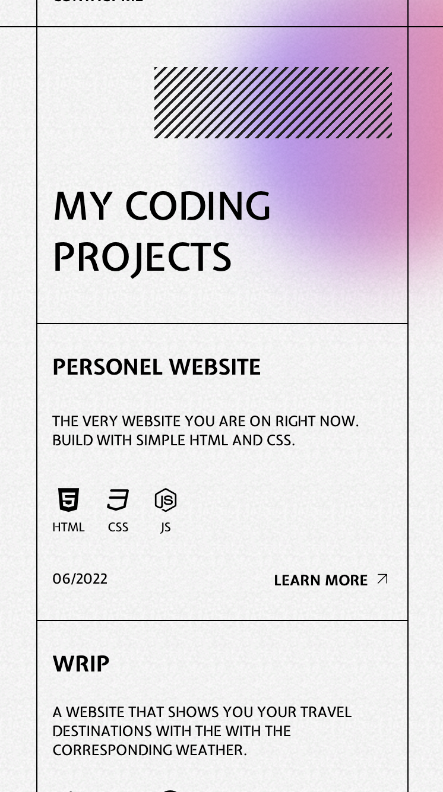

# Personal-Website
My personal website wrote with HTML, CSS and JavaScript

This website was built with a simple CSS grid and consists of 3 sections. The font is from Google Font and icons were obtained from Iconscout as unicons.

## Screens Mobile

